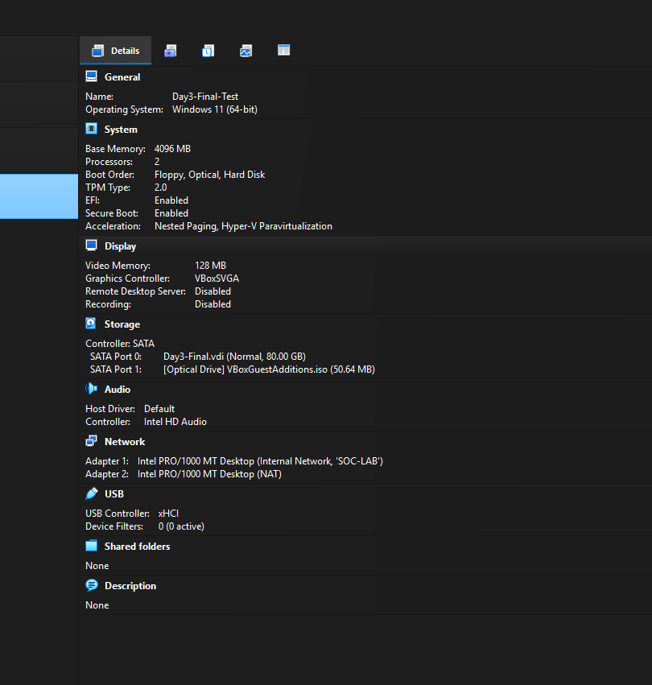
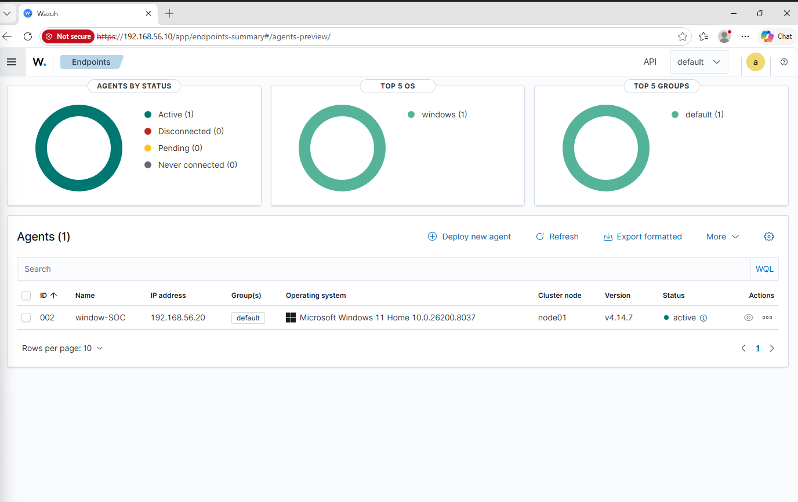
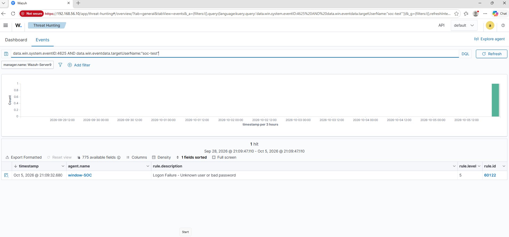
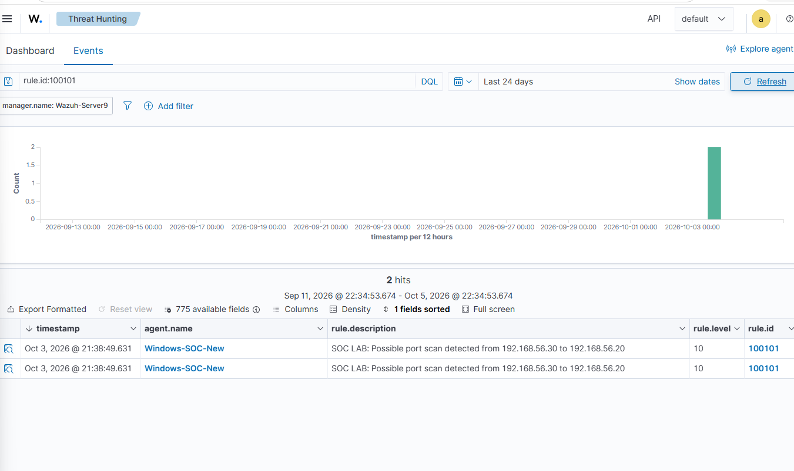
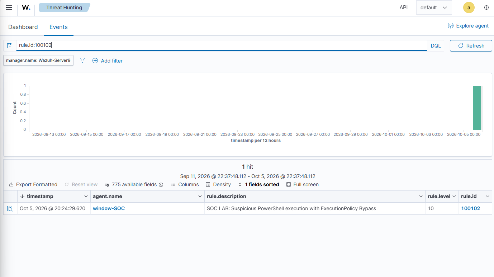

# SOC Sentinel Lab

A hands-on **Virtual Security Operations Center (SOC) lab** built in Oracle VirtualBox to practice endpoint monitoring, log analysis, detection engineering, and alert investigation using **Wazuh**.

The lab demonstrates a complete defensive workflow:

**Controlled Activity → Endpoint/Firewall Logs → Wazuh Collection → Rule Evaluation → Alert → Analyst Investigation**

---

## Project Overview

This project was created as a personal SOC environment for practical cybersecurity training and portfolio development.

The environment contains three virtual machines connected through an isolated internal network:

| System | Role | IP Address |
|---|---|---|
| Ubuntu Server | Wazuh Manager | `192.168.56.10` |
| Windows 11 Home | Monitored Endpoint / Wazuh Agent | `192.168.56.20` |
| Kali Linux | Security Testing VM | `192.168.56.30` |

The internal SOC network uses:

`192.168.56.0/24`

A NAT adapter was retained where required for updates and package installation.

---

## Lab Architecture

```text
                    ┌──────────────────────┐
                    │     Kali Linux       │
                    │   Testing Machine    │
                    │   192.168.56.30      │
                    └──────────┬───────────┘
                               │
                               │ SOC-LAB
                               │ 192.168.56.0/24
                               │
          ┌────────────────────┴────────────────────┐
          │                                         │
┌─────────▼──────────┐                    ┌─────────▼──────────┐
│    Windows 11      │                    │   Ubuntu Server    │
│ Monitored Endpoint │ ───── Wazuh ─────▶ │   Wazuh Manager   │
│  192.168.56.20     │       Agent        │  192.168.56.10    │
└────────────────────┘                    └────────────────────┘
```

---

## Technologies Used

- Oracle VirtualBox
- Wazuh
- Ubuntu Server
- Windows 11 Home
- Kali Linux
- Windows Event Viewer
- PowerShell
- Windows Firewall Logging
- File Integrity Monitoring (FIM)
- Nmap
- MITRE ATT&CK

---

## Wazuh Agent

The Windows endpoint was successfully connected to the Wazuh manager.

- **Agent ID:** `002`
- **Agent Version:** `4.14.7`
- **Endpoint:** Windows 11 Home
- **Status:** Active

---

## Detection Scenarios

### 1. Failed Windows Logon Detection

A controlled failed-login attempt was generated on the Windows endpoint.

**Detection details:**

- Windows Event ID: `4625`
- Wazuh Rule: `60122`
- Alert Level: `5`
- Event Type: Authentication Failure

This scenario demonstrated how Windows authentication events can be collected and investigated through Wazuh.

---

### 2. File Integrity Monitoring

Wazuh File Integrity Monitoring was used to detect changes to monitored files.

**File Added**

- Wazuh Rule: `554`
- Alert Level: `5`

**File Modified**

- Wazuh Rule: `550`
- Alert Level: `7`

This demonstrated how SOC analysts can monitor important directories and detect unauthorized file changes.

---

### 3. Port Scan Detection

A controlled Nmap scan was performed from Kali Linux against the Windows endpoint.

**Source**

`192.168.56.30`

**Target**

`192.168.56.20`

A custom Wazuh detection rule was used to identify the scanning activity.

- Custom Rule: `100101`
- Alert Level: `10`

This scenario demonstrated how network reconnaissance activity can be identified through endpoint/firewall telemetry.

---

### 4. Suspicious PowerShell Detection

A controlled PowerShell activity was generated on the Windows endpoint and detected through process creation logs.

**Detection details:**

- Windows Event ID: `4688`
- Custom Wazuh Rule: `100102`
- Alert Level: `10`
- MITRE ATT&CK: `T1059.001 – PowerShell`

This scenario demonstrated basic detection engineering and MITRE ATT&CK mapping.

---

## SOC Investigation Workflow

For each scenario, the following process was followed:

1. Generate controlled activity inside the isolated lab.
2. Collect endpoint or firewall telemetry.
3. Forward logs to the Wazuh manager.
4. Allow Wazuh decoders and rules to evaluate the activity.
5. Generate an alert.
6. Investigate the alert using Wazuh Threat Hunting or FIM views.
7. Preserve screenshots and evidence for documentation.

---

## Key Results

The lab successfully demonstrated:

- Windows security log collection
- Wazuh agent deployment and validation
- Authentication failure detection
- File integrity monitoring
- Port-scan detection
- Custom Wazuh rule creation
- Suspicious PowerShell detection
- MITRE ATT&CK mapping
- Alert investigation
- Evidence preservation
- Basic SOC analyst workflow

The strongest detections in the project were the custom **Level 10 port-scan alert** and the **PowerShell process detection**.

---

## Skills Practiced

- SIEM monitoring
- Log analysis
- Windows event analysis
- Detection engineering
- Wazuh rule configuration
- Threat hunting
- File integrity monitoring
- Network reconnaissance analysis
- MITRE ATT&CK mapping
- Incident investigation
- Virtual network configuration
- Technical documentation

---

## Repository Structure

```text
SOC-Sentinel-Lab/
│
├── README.md
├── Documentation/
│   └── SOC-LAB-Final-Report.pdf
│
├── Screenshots/
│   ├── architecture/
│   ├── wazuh-agent/
│   ├── failed-logon/
│   ├── fim/
│   ├── port-scan/
│   └── powershell/
│
└── Configuration/
    └── custom-rules/
```

---

## Project Evidence

### Lab Architecture


### Wazuh Agent Validation


### Failed Logon Detection


### Port Scan Detection


### Suspicious PowerShell Detection


---

## Full Technical Report

📄 [View the complete SOC Lab Final Report](Documentation/SOC-Lab-Final-Report.pdf)


---

## Project Report

A full technical report is included in the `Documentation` folder with:

- Project objectives
- Architecture and network design
- Wazuh agent validation
- Detection scenarios
- Analyst findings
- Skills and lessons learned
- Key commands and queries

---

## Disclaimer

This project was created for **educational and defensive cybersecurity purposes only**.

All testing was performed in a controlled, isolated virtual lab environment owned by the project author.

---

## Author

Cybersecurity Diploma Student  
Interested in SOC Operations, Blue Team, Threat Detection, and Incident Response.
